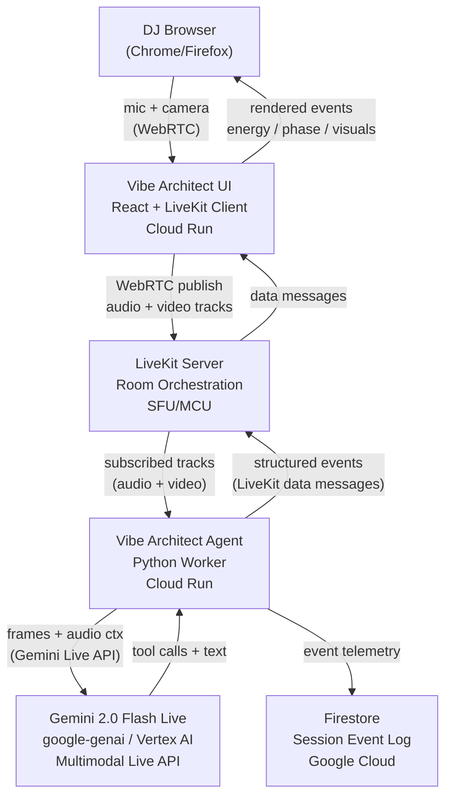

# Vibe Architect 🎛️

**Autonomous multimodal DJ copilot — Gemini Live Agent Challenge**

Vibe Architect listens to a live DJ mix, watches the crowd via camera, estimates crowd energy, detects drops and transitions, recommends the next track, and autonomously triggers synchronized visuals — all in realtime using the Gemini 2.0 Flash Live API.

It is not a chatbot. It is a realtime performance copilot that behaves like an elite booth-side AI.

---

## Architecture



---

## Monorepo Layout

```
/README.md
/.env.example
/docker-compose.yml
/agent
  /agent.py          ← LiveKit worker + Gemini integration
  /tools.py          ← AI tool functions
  /state.py          ← Typed session state
  /requirements.txt
  /Dockerfile
/vibe-architect-ui
  /package.json
  /vite.config.ts
  /src/App.tsx        ← Root component + LiveKit room
  /src/main.tsx
  /src/components/    ← ConnectionPanel, StatusBar, CrowdCam,
  /                     AudioVisualizer, EventLog, ControlStrip
  /src/lib/           ← types.ts, mockToken.ts
  /src/styles.css
/deploy
  /cloudrun-agent.yaml
  /cloudrun-ui.yaml
  /architecture.md
```

---

## Local Setup

### Prerequisites

- Python 3.12+
- Node.js 20+
- A LiveKit account (or local LiveKit server)
- Google AI API key **or** GCP project with Vertex AI enabled

### 1. Clone and configure

```bash
git clone https://github.com/wildhash/vibe-architect
cd vibe-architect
cp .env.example .env
# Edit .env with your credentials
```

### 2. Run the Python agent

```bash
cd agent
python -m venv .venv
source .venv/bin/activate
pip install -r requirements.txt
python agent.py start
```

### 3. Run the frontend

```bash
cd vibe-architect-ui
npm install
npm run dev
# Open http://localhost:3000
```

---

## Environment Variables

| Variable | Description | Required |
|---|---|---|
| `LIVEKIT_URL` | LiveKit WebSocket server URL | ✅ |
| `LIVEKIT_API_KEY` | LiveKit API key | ✅ |
| `LIVEKIT_API_SECRET` | LiveKit API secret | ✅ |
| `GOOGLE_API_KEY` | Gemini API key (direct mode) | One of these two |
| `GOOGLE_GENAI_USE_VERTEXAI` | Set `true` for Vertex AI | One of these two |
| `GOOGLE_CLOUD_PROJECT` | GCP project ID (Vertex mode) | If Vertex |
| `GOOGLE_CLOUD_LOCATION` | GCP region (default: us-central1) | If Vertex |
| `FIRESTORE_COLLECTION` | Firestore collection name | Optional |
| `VITE_LIVEKIT_URL` | LiveKit URL for the frontend | ✅ |
| `VITE_LIVEKIT_TOKEN` | Pre-generated dev token | Local dev |

---

## Docker / Cloud Run Deployment

### Build and push the agent image

```bash
gcloud auth configure-docker
docker build -t gcr.io/YOUR_PROJECT/vibe-architect-agent ./agent
docker push gcr.io/YOUR_PROJECT/vibe-architect-agent
```

### Deploy to Cloud Run

```bash
# Edit deploy/cloudrun-agent.yaml — replace YOUR_PROJECT_ID
gcloud run services replace deploy/cloudrun-agent.yaml --region us-central1

# Store secrets in Secret Manager
gcloud secrets create vibe-architect-secrets --data-file=.env
```

### Deploy the UI

```bash
cd vibe-architect-ui
npm run build
# Option A: Cloud Run (Nginx container)
docker build -t gcr.io/YOUR_PROJECT/vibe-architect-ui .
gcloud run services replace ../deploy/cloudrun-ui.yaml --region us-central1

# Option B: Firebase Hosting (simpler for static builds)
firebase deploy --only hosting
```

---

## Hackathon Requirements Checklist

| Requirement | How satisfied |
|---|---|
| ✅ Uses a Gemini model | `gemini-2.0-flash-live-001` via `google-generativeai` / Vertex AI |
| ✅ Uses Google GenAI SDK or ADK | `google-generativeai` SDK + `google-cloud-aiplatform` (Vertex) |
| ✅ Uses at least one Google Cloud service | Vertex AI + Cloud Run + Firestore |
| ✅ Designed for Google Cloud backend | Cloud Run deployment YAML provided |
| ✅ Multimodal realtime input/output | Audio stream + periodic video frames → Gemini Live → tool calls → UI |
| ✅ Materials for judges | README + architecture.md + deploy/ configs |

---

## Known Limitations & Next Steps

- **Gemini Live plugin API**: The `livekit-plugins-google` multimodal-live interface is new; the agent includes a `TODO` comment showing the intended wiring. The autonomous loop provides full demo functionality independently.
- **BPM detection**: Currently uses a DJ-supplied value; integrate Essentia or Librosa for real-time BPM analysis.
- **Token generation**: Production deployments should generate LiveKit tokens server-side; see `src/lib/mockToken.ts` for the dev fallback.
- **Visual system**: `trigger_visuals` logs a payload; wire to a real DMX/OSC adapter for venue use.
- **Crowd vision**: Frame analysis is simulated; integrate a vision model for real movement classification.

## Proof of Google Cloud Deployment

Record a video showing:
1. `gcloud run services list` output showing both services live.
2. Cloud Run logs streaming agent events.
3. Firestore console showing written session events.
4. The live UI in a browser connected to the room.
