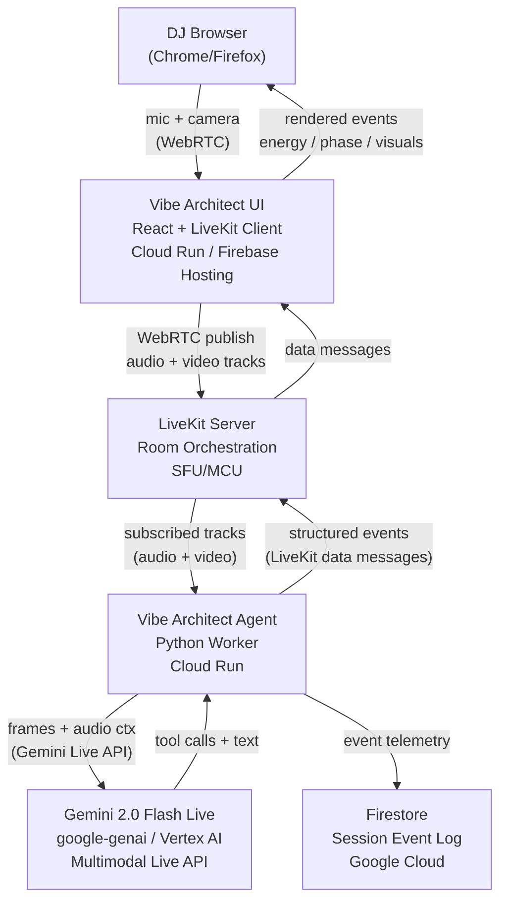

# Vibe Architect — Architecture

## System Architecture

## Component Descriptions

| Component | Tech | Responsibility |
|---|---|---|
| Vibe Architect UI | React 18 + TypeScript + Vite + @livekit/components-react | Booth interface; publishes local A/V; displays agent events |
| LiveKit Server | LiveKit Cloud or self-hosted | WebRTC room / SFU; relays tracks and data messages |
| Vibe Architect Agent | Python 3.12 + livekit-agents + google-genai | Subscribes to room; drives Gemini Live; executes tools; emits events |
| Gemini 2.0 Flash Live | Vertex AI / Google AI API | Multimodal realtime reasoning; function calling |
| Firestore | Google Cloud Firestore | Optional session telemetry persistence |

## Data Flow

1. DJ opens browser → connects to LiveKit room via UI.
2. Browser publishes mic (DJ master out) + camera (crowd cam) as WebRTC tracks.
3. Agent subscribes to those tracks.
4. Agent samples video frames at ~1 FPS (JPEG) and streams audio continuously.
5. Gemini Live processes audio+frames → issues tool calls (analyze_crowd_energy, suggest_next_track, trigger_visuals, etc.).
6. Agent executes tool calls → results fed back to Gemini.
7. Agent emits structured JSON events to UI via LiveKit data messages.
8. UI renders energy, phase, recommendation, visual trigger in real time.
9. Events optionally written to Firestore for session replay / analytics.

## Google Cloud Services Used

| Service | Role | Hackathon Requirement |
|---|---|---|
| Vertex AI (Gemini 2.0 Flash Live) | Core multimodal reasoning engine | Gemini model + Google Cloud AI |
| Cloud Run (agent) | Backend deployment target | Google Cloud deployment |
| Cloud Run (UI) | Frontend serving | Google Cloud deployment |
| Firestore | Event log persistence | Google Cloud service |
| Google Container Registry | Docker image hosting | Google Cloud |

## Security Notes

- All credentials loaded from Cloud Run secrets / Secret Manager.
- LiveKit tokens are short-lived JWTs generated server-side.
- No credentials in source code.
- Firestore access governed by service account with least-privilege IAM.
